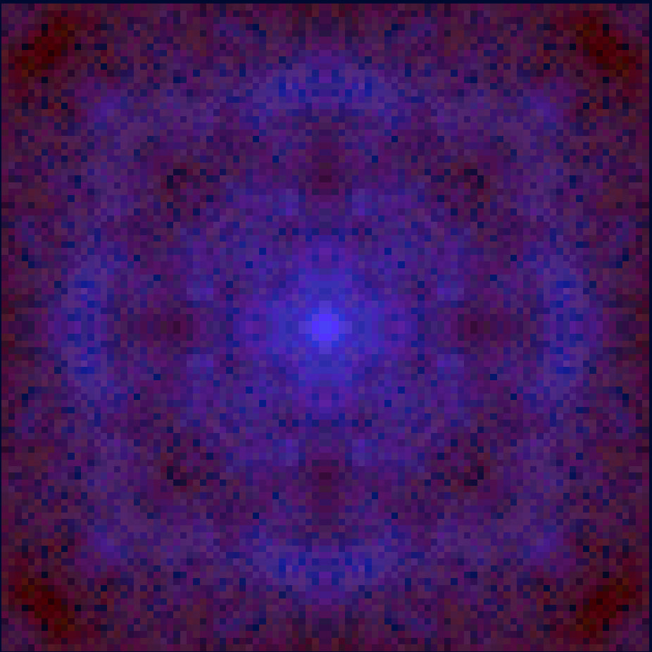
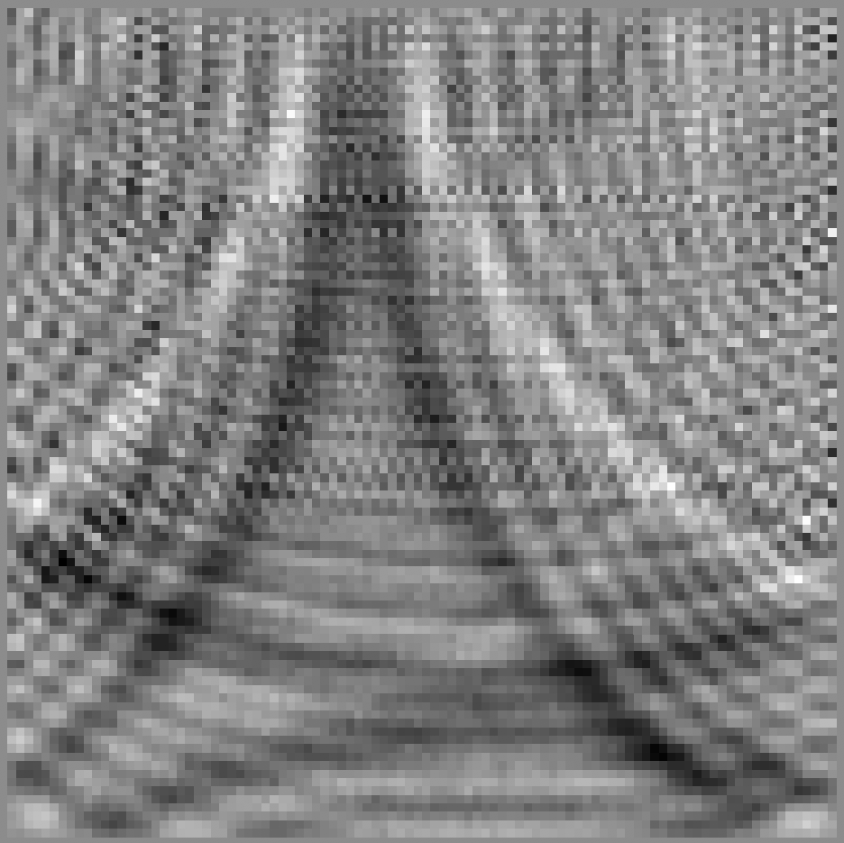
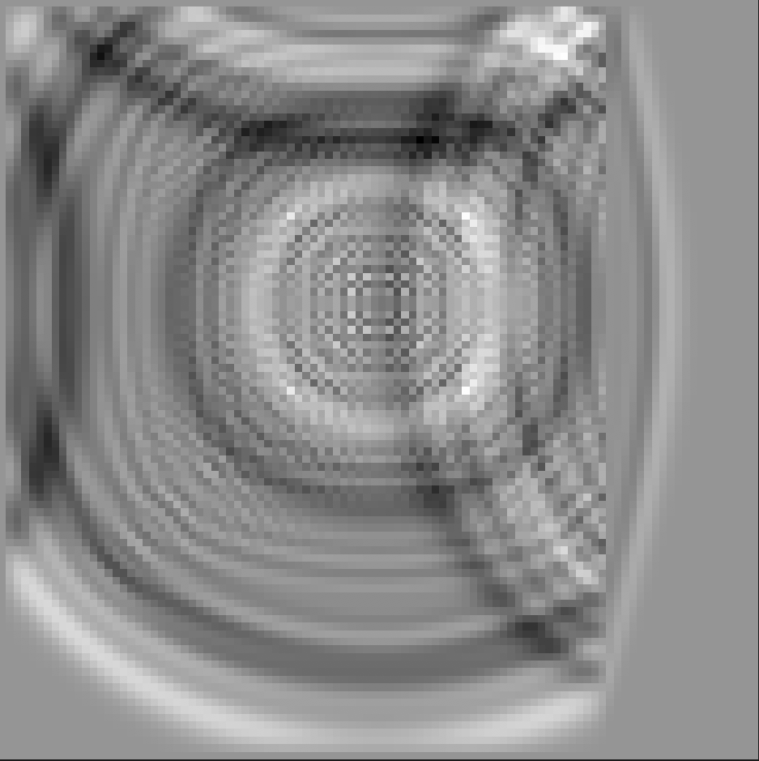

# A simple interactive 2D wave- and heat- equation simulation

A simple (but quite fast and vary customizable) wave/heat simulation. It's all yours to explore.

The demo link: (todo).

Docs about scripting language used for setting functions inside see [there](https://docs.rs/evalexpr/latest/evalexpr/index.html).

I doubt that project for fun will be interesting to anyone, so I wouldn't describe the meaning of all the sliders in the demo. Feel free to make an issue if you are interested, I will probably do it.

Some beautiful images you can get with it:

